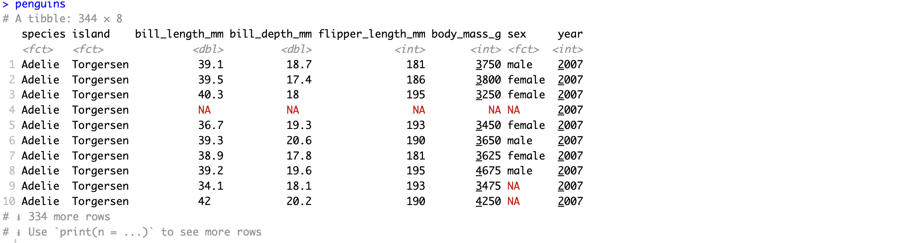

# R-Wrangling

## Overview

In this workshop, we will explore the fundamentals of data wrangling using the `tidyverse` package in R. Data wrangling involves transforming and preparing raw data into a format suitable for analysis and visualization.  


## Prerequisites

Participants should have:
- Basic knowledge of R syntax
- Familiarity with data frames and vectors
- Installed R and RStudio

If you are new to R please refer to [Basic R Guide](https://github.com/vinumanikandan/R-visualization/blob/main/README.md) for a comprehensive introduction and helpful resources.


## Agenda

1. **Introduction to tibble**
   - Why tibble ?
   - Create and transform to tibble

2. **Introduction to `dplyr`**
   - Overview of the `dplyr` package
   - Basic commands : `select`, `filter`, `arrange`, `mutate`, `summarize`

3. **Data Transformation with `dplyr`**
   - Working with factors and character strings
   - Using pipes (`%>%`) for chaining operations
   - Case study: Cleaning and transforming messy data

4. **Reshaping Data with `tidyr`**
   - Introduction to `tidyr` for data reshaping
   - Converting between wide and long formats
   - Handling missing values

5. **Combining Data Sets**
   - Joining (`left_join`, `inner_join`, etc.) data frames
   - Case study: Merging datasets from different sources

6. **Data Visualization with `ggplot2`**
   - Introduction to `ggplot2` for data visualization
   - Basic plotting functions: `ggplot`, `geom_point`, `geom_bar`, `geom_line`
   - Customizing plots with themes and aesthetics
   - Exercises

7. **Advanced `dplyr` Techniques**
   - Grouping and summarizing data (`group_by`, `summarize`)
   - Advanced filtering and conditional operations
   - Exercises

8. **Case Study: Real-world Data Wrangling**
   - Applying `tidyverse` principles to a complex dataset
   - Practical tips and strategies for efficient data wrangling
   - Exercises

9. **Conclusion and Next Steps**
   - Recap of key concepts and techniques learned
   - Resources for further learning (books, online tutorials, etc.)
   - Q&A and Feedback


# 1. Introduction to tibble


A data frame in R is a two-dimensional data structure used to store tabular data. It is similar to a table in a database or a spreadsheet in Excel.

***Normal structure of Dataframe***
  - Columns: Each column represents a variable and can hold different types of data. For example, one column might contain numeric data, while another column might contain character strings.
  - Rows: Each row represents an observation or a record. All rows must have the same number of elements (i.e., the same number of columns).

**Cons of dataframes**


  1. Data frames can be slower and less memory-efficient when handling very large datasets & can affect performance during data manipulation and analysis.
  2. data frames support basic data manipulation tasks and complex manupulations will be strenuous
  3. Difficult to handle datasets that have non-standard or special character column names.


**tibble**
[tibble](https://tibble.tidyverse.org) are a modern reimagining of data frames provided by the `tibble` package in the tidyverse collection. One of the main benefits of tibbles is that they are more robust and user-friendly: 


  1. they do not change variable names or types, are more consistent in their behavior
  2. provide a cleaner print method that fit on screen, which is particularly useful for large datasets
  3. provide better support for non-standard column names , making them more compatible with the dplyr and tidyr packages for data manipulation.
  
Overall, using tibbles can lead to more readable and maintainable code, enhancing the data wrangling process.

### Set up

```
install.packages("palmerpenguins")

# install the complete tidyverse packages
install.packages("tidyverse")

# Alternatively, install just dplyr:
install.packages("dplyr")

# Load the packages
library(palmerpenguins)

## Load either 1 of the following
library(dplyr) ## load only dplyr
library(tidyverse) ## load all tidyverse packages

```

**Load the Dataset**
The palmerpenguins package provides a dataset with measurements of three penguin species
```
penguins

```

{width :50%}

**Converting tibble as data frame**

```
# Convert tibble  to a normal data frame

penguins_df <- as.data.frame(penguins

# Create a tibble from an existing dataframe
penguins_df_tibble<-as_tibble(penguins_df)

```

## Excercise 1 :

Using the Base R methods do the following on the dataframe `penguins_df`

1) subset columns species, island, bill_length_mm, bill_depth_mm
2) Consider only bill_length_mm is greater than 40
3) Create a new new column called `bill_ratio` (bill_length_mm / bill_depth_mm)
4) find mean bill_length_mm by species
   
<details>
  <summary>Excercise 1 Answer</summary>
  
```
# subset columns species, island, bill_length_mm, bill_depth_mm
penguins_selected_df <- penguins_df[, c("species", "island", "bill_length_mm", "bill_depth_mm")]

# Consider only bill_length_mm is greater than 40

penguins_selected_filtered_df <- penguins_selected_df[penguins_selected_df$bill_length_mm > 40, ]
dim(penguins_selected_filtered_df)

# Create a new new column called `bill_ratio` (bill_length_mm / bill_depth_mm)

penguins_selected_filtered_df <- transform(penguins_selected_filtered_df, bill_ratio = bill_length_mm / bill_depth_mm)
penguins_selected_filtered_df


#  find mean bill_length_mm by species

mean_bill_length_mm <- aggregate(penguins_selected_filtered_df$bill_length_mm ~ penguins_selected_filtered_df$species, FUN = mean)
mean_bill_length_mm
```

</details>

# 2. Introduction to `dplyr`

dplyr package is used for data manipulation and its attained using the following methods :

   - select() picks variables based on their names.
   - filter() picks cases based on their values.
   - mutate() adds new variables that are functions of existing variables.
   - slice() picks cases based on their position.
   - summarize() reduces multiple values down to a single summary.
   - arrange() changes the ordering of the rows.
   - group_by() perform any operation by group.

  For more information on [`dplyr`](https://dplyr.tidyverse.org)
  
- **i. select()**
  
The select function in dplyr is used to choose specific columns (subset) from a data relevant to analysis. By providing the names of the columns you want to keep, select allows you to quickly and intuitively subset your dataset.

There are helper functions to select columns based on specific patterns such as

   -   starts_with()
   -    ends_with()
   -    contains()
   -    matches()
     
This function enhances code readability and efficiency by streamlining the process of working with large datasets and eliminating the need to repeatedly specify unwanted columns.

Syntax : **select(`tb`, COLUMN_NAMES)**

for example subset columns species, island, bill_length_mm, bill_depth_mm from the tibble `penguins`

```
# Method 1 : here first variable is tibble and rest are the coulmns of interest
penguins_selected <- select(penguins,species, island, bill_length_mm, bill_depth_mm)

# Method 2 :c() for combining selections
penguins_selected2 <- select(penguins,c(species, island, bill_length_mm, bill_depth_mm))

# Method 3 : for selecting a range of consecutive variables.
penguins_selected3 <- select(penguins,species:bill_length_mm, sex)

# Method 4 : ! for taking the complement of a set of variables.
penguins_selected4 <- select(penguins,!(body_mass_g:year))
penguins_selected4

```
- **ii. filter()**
The filter function in dplyr is used to subset rows based on specified conditions.This function is particularly useful for cleaning and downsampling datasets to the relevant observations for analysis. With filter, you can efficiently handle missing values, outliers, and any other data points that do not fit the requirements of your analysis.

There are many functions and operators that are useful when constructing the expressions used to filter the data:
   - ==, >, >= etc
   - &, |, !, xor()
   - is.na()
   - between(), near()

```
# Filtering by single criteria 
penguins_selected_filtered <- filter(penguins_selected,bill_length_mm > 40)

# Filtering by multiple criteria within a single logical expression, could use &|,
filter(penguins_selected, bill_length_mm >= 40 & bill_depth_mm >= 20)
filter(penguins_selected, bill_length_mm >= 40 , bill_depth_mm >= 20)

# Filtering by multiple criteria within a single logical expression,either 1 condition satisfies,
filter(penguins_selected, bill_length_mm >= 40 | bill_depth_mm >= 20)

```
- **iii. mutate()**

`mutate()` creates new columns that are functions of existing variables. It can also modify value (existing column) and delete columns (by setting their value to NULL).

```
## adding new variables

penguins_selected_filtered_mutated<- mutate(penguins_selected_filtered,bill_ratio = bill_length_mm / bill_depth_mm)
penguins_selected_filtered_mutated
## adding new variables, remove existing variables

penguins_selected_filtered_mutated2<- mutate(penguins_selected_filtered,bill_ratio = bill_length_mm / bill_depth_mm,species=NULL)
penguins_selected_filtered_mutated2

## adding new variables, remove existing variables and modify existing variables.
penguins_selected_filtered_mutated3<- mutate(penguins_selected_filtered,bill_ratio = bill_length_mm / bill_depth_mm,species=NULL,bill_depth_mm=bill_depth_mm ^2)
penguins_selected_filtered_mutated3


```
- **iv. sumarize()**
The `summarize` function in dplyr is used to condense a data into a single summary row , based on specified summary statistics.Functions associated with `summarize` to compute aggregate values are as follows

   - Center: mean(), median()
   - Spread: sd(), IQR(), mad()
   - Range: min(), max(),
   - Position: first(), last(), nth(),
   - Count: n(), n_distinct()
   - Logical: any(), all()


Often `summarize` is used in conjuction with **.by()| group_by()**

```
#global average
summarize(penguins_selected_filtered_mutated,mean_bill_length_mm = mean(bill_length_mm, na.rm = TRUE))

# average within species levels
summarize(penguins_selected_filtered_mutated,mean_bill_length_mm = mean(bill_length_mm, na.rm = TRUE),.by='species')

```

- **v. group_by()**
  
`group_by` function in dplyr is used to group data by one or more variables. This is particularly useful for summarizing and analyzing subsets of data within a larger dataset. When used in combination with functions like summarize, mutate, or filter, group_by allows for powerful and flexible data manipulation, facilitating comparative analysis across different groups.

```
# Grouping by single column
penguins_selected_filtered_mutated_group<-group_by(penguins_selected_filtered_mutated,species)

# Grouping by multiple column

penguins_selected_filtered_mutated_group2<-group_by(penguins_selected_filtered_mutated,species,island)

```

- **vi. arrange()**

`arrange` function in dplyr is used to sort the rows  based on the values of one or more columns. By specifying the columns to sort by, arrange can order data in ascending or descending order.

```
arrange(penguins_selected_filtered_mutated_group,desc(bill_length_mm))

```
3. **Data Transformation with `dplyr`**
   
`dplyr` functions are used in conjunction with `forcats`: for factor manipulation and `stringr` for character string operations.

Some methods associated with these libraries are as follow

   - `as.factor` (from R base): Ensure column is a factor
   - `fct_relevel()`, `fct_reorder()` (from forcats package): Reorder and relabel factor levels
   - `str_detect()`, `str_replace()`, `str_to_upper()` (from stringr package): Perform string manipulations

```
### Ensuring the column as factor and relevel species

mutate(penguins_selected_filtered, # tibble variable
    species = as.factor(species),  # Ensure species is a factor
    species = fct_relevel(species, "Adelie", "Chinstrap", "Gentoo")  # Relevel species factor
  )

# Updating the existing coulmn by making the values in island to upercase
penguins_selected_filtered_upercase<- mutate(penguins_selected_filtered, # tibble variable
    island = str_to_upper(island)  # Convert island names to uppercase
  )
# Filtering the datafor whose island contains "T"
  filter(penguins_selected_filtered_upercase,
         str_detect(island, "T")
      ) 
```
 **Using pipes (`%>%`) for chaining operations**

Those who is familiar with bash the pipe`|` operator passes the output of one command as the input to the next, enabling streamlined command sequences. 

```
   # in bash
   command | command | command > output.txt
```
Similarly, in `dplyr`,  `%>%` or  `|>`  instead of `|` pipe operator can chain together multiple functions, allowing for clear, readable, and sequential data manipulation. This operator is provided by the `magrittr` package.


All the the above data wrangling steps can be condensed to on single line


```
# perform a series of operations
result_tbl <- penguins %>%
  select(species, island, bill_length_mm, bill_depth_mm) %>%
  filter(bill_length_mm > 40) %>%
  mutate(bill_ratio = bill_length_mm / bill_depth_mm) %>%
  group_by(species) %>%
  summarize(mean_bill_length_mm = mean(bill_length_mm, na.rm = TRUE))

# Print the result
print(result_tbl)

```

## Exercise 2:

Use the iris dataset to demonstrate data manipulation with dplyr pipes.

1. Load the iris dataset and convert it to a tibble.
2. Select the columns Sepal.Length, Sepal.Width, Petal.Length, Petal.Width, and Species.
3. Filter the rows to include only those iris flowers with Sepal.Length greater than 6.
4. Create a new column Sepal.Ratio which is the ratio of Sepal.Length to Sepal.Width.
5. Group the data by Species and calculate the mean Sepal.Length and mean Sepal.Ratio for each species.

<details>
  <summary>Excercise 2 Answer</summary>
  
```
iris_tbl <- as_tibble(iris)

# Perform the data manipulation steps
result_tbl <- iris_tbl %>%
# Select the columns Sepal.Length, Sepal.Width, Petal.Length, Petal.Width, and Species.
  select(Sepal.Length, Sepal.Width, Petal.Length, Petal.Width, Species) %>%
# Filter the rows to include only those iris flowers with Sepal.Length greater than 6.
  filter(Sepal.Length > 6) %>%
# Create a new column Sepal.Ratio which is the ratio of Sepal.Length to Sepal.Width.
  mutate(Sepal.Ratio = Sepal.Length / Sepal.Width) %>%
# Group the data by Species and 
  group_by(Species) %>%
# calculate the mean Sepal.Length and mean Sepal.Ratio for each species.
  summarize(
    mean_Sepal.Length = mean(Sepal.Length, na.rm = TRUE),
    mean_Sepal.Ratio = mean(Sepal.Ratio, na.rm = TRUE)
  )

iris_tbl

```

</details>

# 4 Reshaping Data with tidyr

- `tidyr` is an essential package in the `tidyverse` that simplifies the process of reshaping and tidying data in R.
- `tidyr` makes it easier to handle messy data, ensuring that it is structured in a way that facilitates analysis and visualization.
- Has a suite of functions designed to transform data into a tidy format, where each variable is a column, each observation is a row, and each type of observational unit forms a table.
-  Key functions like pivot_longer() and pivot_wider()  which converts between long and wide formats

```
#Initializing the tidyr package
library(tidyr)
```
## Exercise 2:

1.  Install `airway package`, which contains RNA-seq gene expression data from an experiment with human airway smooth muscle cells and load the data.
2.  Convert the data to tibble formate
<details>
  <summary>Excercise 3 Answer</summary>
  
```
#install and initialise library
BiocManager::install("airway")        
library(airway)

#Load airway
data("airway")

# Convert SummarizedExperiment object to dataframe
airway_df <- as.data.frame(assay(airway))
airway_df

# Convert dataframe  to tibbl
airway_tbl <- as_tibble(airway_df, rownames = "gene")
airway_tbl

```
</details>

**Converting between wide and long formats**

`pivot_longer()` to convert the dataset from wide to long format,
with sample as the column indicating the sample and expression as the gene expression values.

```
# From wide to long format using pivot_longer
long_data <- airway_tbl %>%
  pivot_longer(cols = -gene, 
               names_to = "sample", 
               values_to = "expression")
```

`pivot_wider()` to convert the long format data  to wide format, with separate columns for each sample.

```
wide_data <- long_data %>%
  pivot_wider(names_from = "sample", values_from = "expression")
wide_data
```
**Handling missing values**

# 5.Combining Data Sets

Joining (left_join, inner_join, etc.) data frames
Case study: Merging datasets from different sources
Data Visualization with ggplot2
